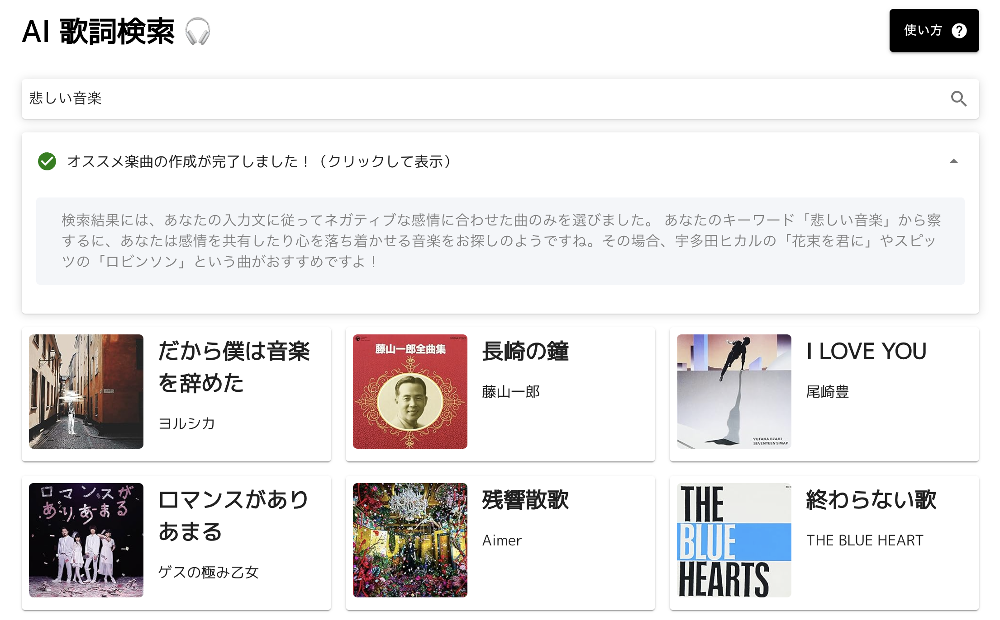

# AI 歌詞検索アプリ
生成AIを利用することで、自然言語で歌詞を検索することができるウェブアプリです。



## 1. 特徴

- **文章のベクトル化・センチメント分析**:
    - Pandasを使ったデータフレーム（元CSVフォーマット）のデータクリーニング
    - Hugging Face Transformersテキスト分類モデルを用いて、歌詞をベースにセンチメントスコアの割り当て
    - OpenAIのEmbeddingモデルを用いてテキストデータ（曲名、アーティスト名、歌詞を含むメタデータ）をベクトル化

- **自然言語処理・セマンティック検索**:
    - ベクトル化した情報をQdrantクラウドに保存
    - Langchain / OpenAIのGPT-3.5 Turboモデルを用いたユーザークエリのベクトル化・フィルタリング・洞察の生成
    - ベクトル化されたユーザーのクエリとフィルターを元にセマンティック検索を実行

- **API・UI開発**:
    - Flask/PythonによるAPIのエンドポイント開発・提供
    - React/TypeScriptを使ったインターフェース開発。ユーザーの入力したクエリを元にリクエスト送信・レスポンス解析

## 2. セットアップ

このアプリは、FlaskバックエンドとReactフロントエンドで構成されています。以下の手順に従って、開発環境を構築してください。

0. 環境変数の追加
    - `./app`フォルダに`.env`ファイルを作成し、次の環境変数を追加します：

        ```
        GROQ_API_KEY=your_groq_api_key # Or you can use OpenAI OPENAI_API_KEY=your_openai_api_key
        QDRANT_API_KEY=your_qdrant_api_key
        QDRANT_URL=your_qdrant_url
        ```
    
    - これにより、バックエンド実行時にOpenAIとQdrantがこれらの環境変数にアクセスできるようになります。`.env`ファイルを共有したり、APIキーを公開しないように注意してください。

1. Flaskバックエンドのセットアップ:

    - Pythonを使って仮想環境を作成し、アクティベートします：

        ```
        python -m venv venv
        source venv/bin/activate  # Windowsの場合は venv\Scripts\activate
        ```

    - 必要なパッケージをインストールします：

        ```
        pip install -r requirements.txt
        ```

2. Reactフロントエンドのセットアップ:
    - Reactアプリケーションの関連コードは`./client`フォルダに格納されています。

    - `./client`フォルダに移動し、npmパッケージをインストールします：

        ```
        cd client
        npm install
        ```

3. アプリの起動:
    - Flaskサーバーを起動します：

        ```
        gunicorn app:app
        ```

    - Reactサーバーを起動します：

        ```
        npm start
        ```

    - ブラウザで`http://localhost:3000`にアクセスして、アプリを利用できます。

4. 静的ファイルのビルド:
    - アプリをデプロイする場合はフロントエンドの静的ファイルをビルドします：

        ```
        npm run build
        ```

5. 仮想環境の終了
    - 終了時は、仮想環境をディアクティベートします：

        ```
        deactivate
        ```